# CureForever — Enterprise User & Visual Operations Guide

Welcome to the visual operational guide for the **CureForever Enterprise Inventory & Supply Chain Platform**. This guide uses visual diagrams, UI screenshots, structured callout boxes, and practical examples to explain how to operate each module effectively.

---

## 🧭 Visual System Overview

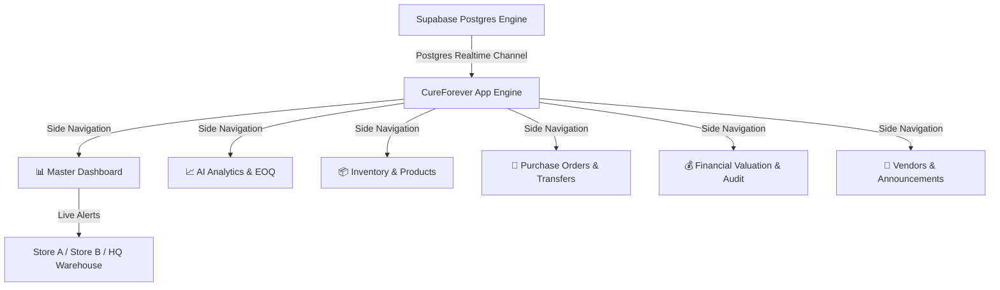

---

## ⚡ 1. Real-Time Multi-Location Sync & Architecture

CureForever keeps every warehouse, pharmacy, and vendor location **synced live in real-time** across all connected devices.

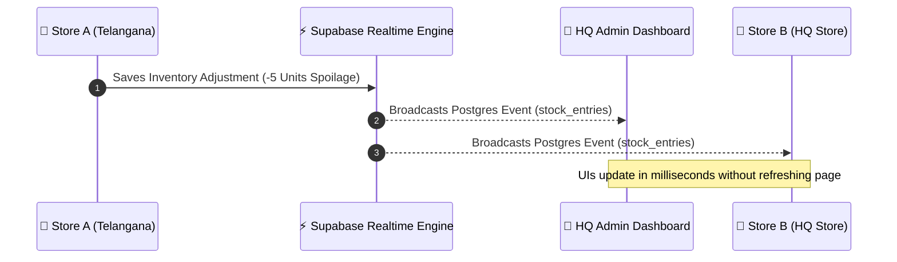

> [!NOTE]
> **Offline Mode Support**: If internet connectivity is interrupted, mutations are saved to a local queue (`OfflineOp`). When connection is restored, the queue automatically flushes to Supabase and displays a confirmation toast.

---

## 📊 Module 1: Master Executive Dashboard

The **Master Executive Dashboard** provides top-level metrics, capital breakdown charts, and real-time inventory depletion warnings.

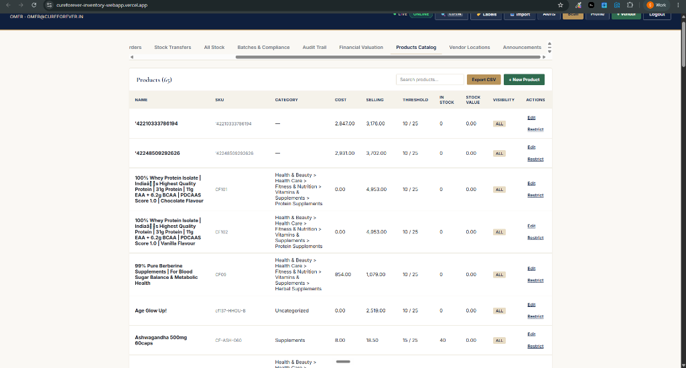

> [!TIP]
> Use the **Low Stock Warnings Widget** on the bottom left of the Dashboard to trigger 1-click **`+ Reorder`** requests for items nearing depletion.

### Key Executive KPIs
| Metric Card | Description | Target / Health Rule |
|---|---|---|
| **Master Catalog SKUs** | Total active product definitions in catalog | Catalog count |
| **Total Cost Valuation** | Total cost asset value ($\sum \text{Qty} \times \text{Cost}$) | Balance sheet asset |
| **Retail Valuation** | Total market value ($\sum \text{Qty} \times \text{Selling Price}$) | Projected revenue |
| **Low / Depleted SKUs** | SKUs below threshold limit | $\le 5\%$ of total catalog |
| **Expiring $\le$ 30 Days** | Batches expiring within 30 days | Require FEFO priority sale |

---

## 📈 Module 2: AI Analytics, Demand Forecasting & EOQ

The **AI Analytics & Forecast Module** computes consumption velocity to project stockout dates and recommend batch purchase sizes.

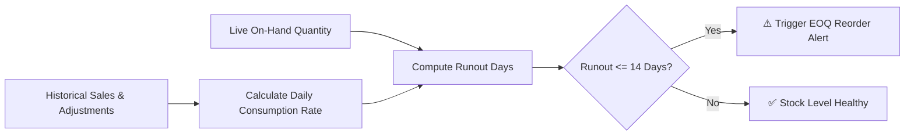

### 🧮 How Economic Order Quantity (EOQ) is Calculated

$$EOQ = \sqrt{\frac{2 \times D \times S}{H}}$$

> [!IMPORTANT]
> **Practical EOQ Example**:
> - **Product**: Ashwagandha 500mg (SKU: `CF-ASH-060`)
> - **Daily Sales Rate**: 2 units/day $\rightarrow$ **Annual Demand ($D$)**: $2 \times 365 = 730$ units
> - **Fixed Procurement Cost ($S$)**: $\$50.00$ per purchase order
> - **Unit Cost Price**: $\$10.00$ $\rightarrow$ **Annual Holding Cost ($H$)**: $\$10 \times 20\% = \$2.00$
> 
> **Optimal Order Size**:
> $$EOQ = \sqrt{\frac{2 \times 730 \times 50}{2.00}} = \sqrt{36,500} \approx \mathbf{191\text{ units per order}}$$

---

## 📦 Module 3 & 4: Inventory & Products Catalog

Manage master SKUs, unit costs, selling prices, barcodes, and store-level visibility rules.

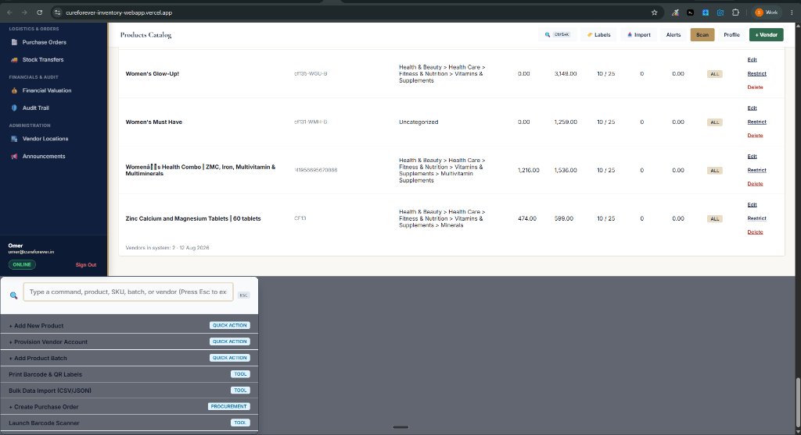

### Actions Column Options
- **`Edit`**: Opens the Product Master Record modal to edit price, SKU, category, or description.
- **`Restrict`**: Restricts SKU visibility to specific authorized vendor locations.
- **`Delete`**: Safely removes product from system along with associated stock lines.

> [!WARNING]
> Deleting a product permanently removes linked visibility policies and stock entries. Ensure stock is depleted or transferred before deleting.

---

## 🧪 Module 5: Batches, FEFO & Quarantine Compliance

Enforce pharmaceutical safety rules, First-Expired First-Out (FEFO) order fulfillment, and quarantine controls.

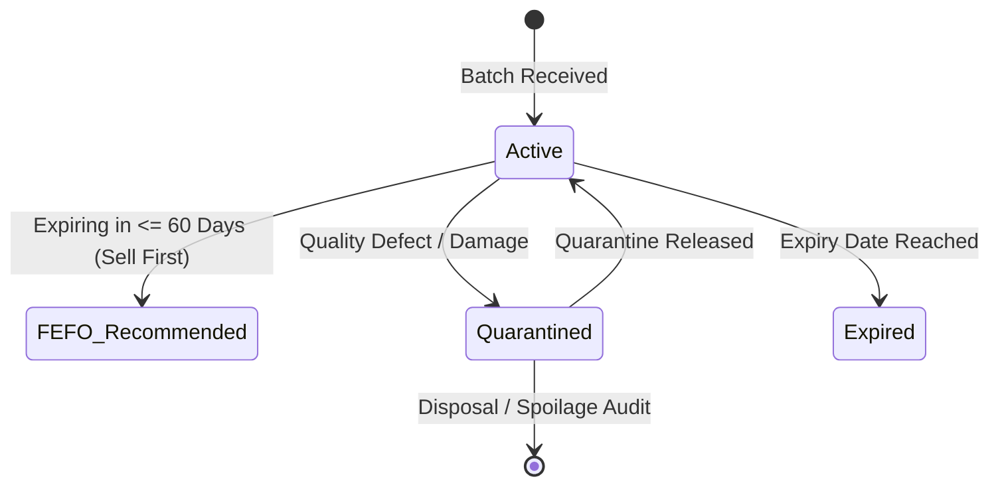

> [!IMPORTANT]
> **FEFO Rule**: Always dispatch batches marked with the **FEFO RECOMMENDED** badge before newer batches to prevent inventory expiration write-offs.

---

## 📑 Module 6 & 7: Purchase Orders & Transfers

Coordinate procurement with suppliers and inter-warehouse stock transfers.

### Purchase Order Procurement Lifecycle

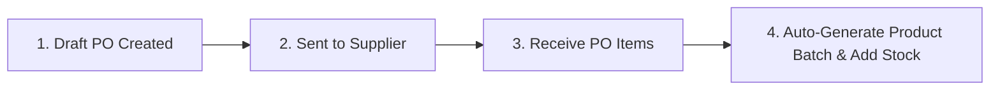

### Inter-Warehouse Transfer Lifecycle

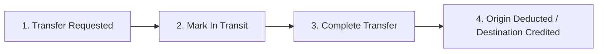

---

## 💰 Module 8: Financial Valuation & Multi-Currency

Evaluate total inventory valuation using standard accounting models:

| Valuation Model | Logic | Best Used For |
|---|---|---|
| **Weighted Average** | Blends total inventory cost across all batches | Standard financial reporting |
| **FIFO (First-In, First-Out)** | Values inventory based on most recent batch cost | Perishable / fast-moving goods |
| **LIFO (Last-In, First-Out)** | Values inventory based on oldest baseline cost | Inflation-hedged commodities |

> [!TIP]
> Use the **Currency Selector** to dynamically convert asset valuations into `USD ($)`, `EUR (€)`, `GBP (£)`, `INR (₹)`, or `CAD ($)`.

---

## 🛡️ Module 9: Immutable Audit Trail

Every stock movement, reason code, user action, and quantity delta ($+$ or $-$) is recorded in an immutable ledger.

### Common Reason Codes
- `manual_adjustment`: Routine inventory count reconciliation.
- `spoilage`: Damaged or expired product disposal.
- `received_delivery`: Supplier Purchase Order delivery receipt.
- `inventory_count`: Physical store count adjustment.

---

## 🏬 Module 10 & 11: Vendor Store Locations & Announcements

Manage store location profiles and corporate announcements.

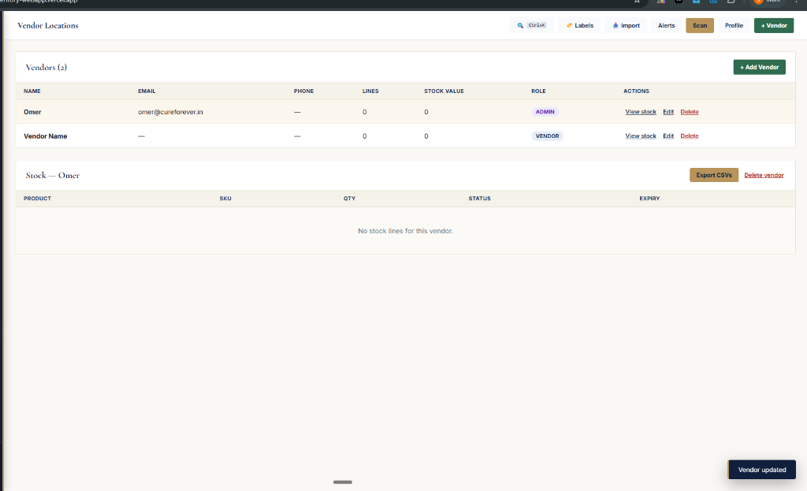

> [!NOTE]
> Store accounts marked as **`HQ ADMIN`** can view all locations and system settings. Store accounts marked as **`VENDOR STORE`** only view stock authorized for their specific store location.

---

## 🏷️ Global Tools: Label Studio, Command Palette & Data Import

### 1. Printable Barcode & QR Label Studio (`LabelStudioModal.tsx`)
Generate Code128 and 2D QR Code labels in single sticker, 30-up sheet, or shelf price tag formats.

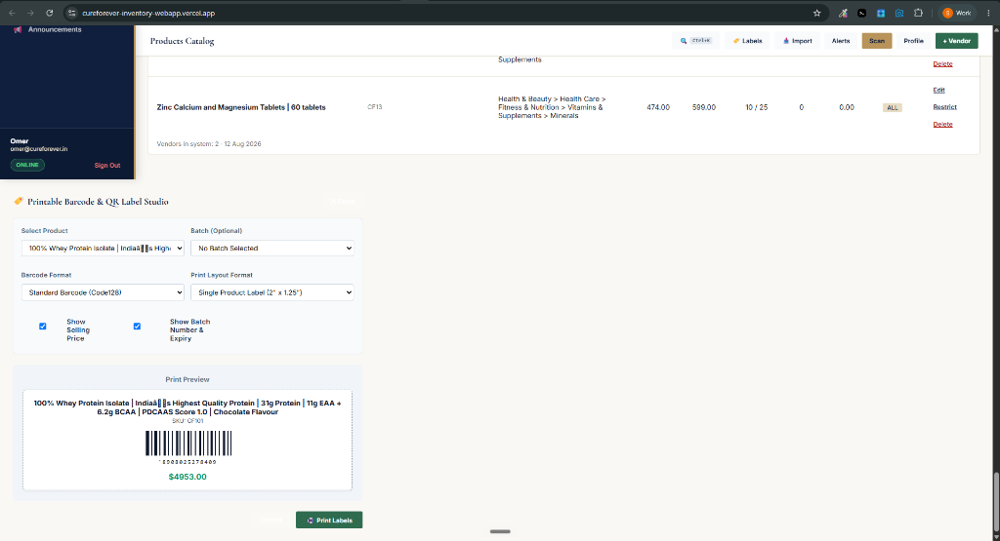

> [!TIP]
> When you click **`🖨️ Print Labels`**, the system automatically isolates the barcode label onto **1 single printed page** and hides the dashboard layout.

---

### 2. Bulk Data Import Wizard (`DataImportModal.tsx`)
Import products or product batches in bulk by pasting CSV or JSON data with live pre-validation checks.

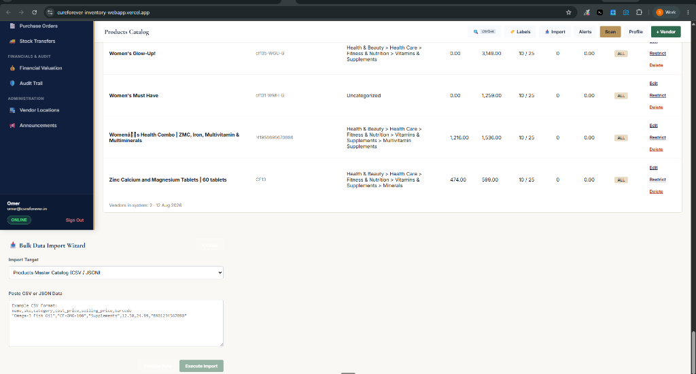

---

### 3. Spotlight Command Palette (`Ctrl+K`)
Press **`Ctrl+K`** or **`Cmd+K`** anywhere in the application to search products, SKUs, or trigger quick actions instantly.
